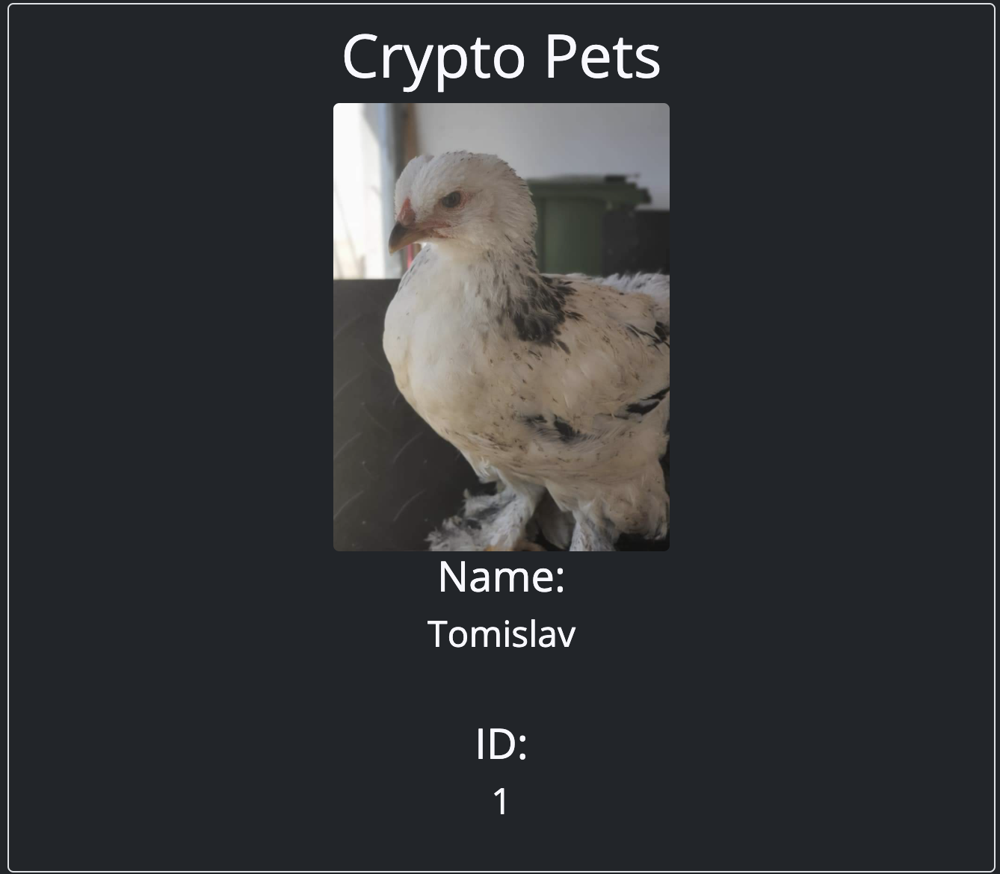
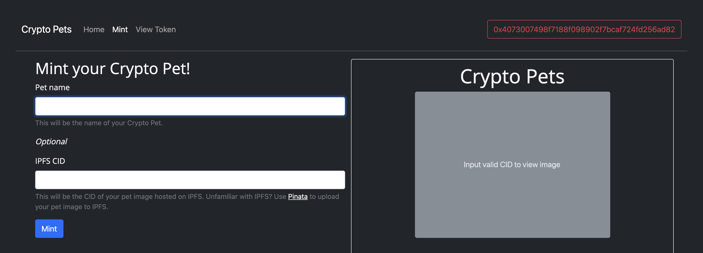

# Crypto Pets

### Mint your pets on the blockchain!

Crypto Pets is an ERC-721 token that enables anyone to tokenize their pet pictures!   
Crypto Pets is currently available on the xDai chain where minting costs less than $0.0002.   
If you never used xDai before, head over to the [xDai Faucet](https://blockscout.com/xdai/mainnet/faucet), to get some free xDai. Enough to mint thousands of Crypto Pets. Remember to set your wallet RPC to the xDai chain! [Heres a guide on how to do it](https://www.xdaichain.com/for-users/wallets/metamask/metamask-setup).

## View token info

All you need to do view a Crypto Pet, is to input the wallet address of the owner, or connect your wallet, and the token ID.   
After submitting, you can view the trading card of the pet.

## Mint new pets

To mint new pets, go to the mint page, and input your pets name and IPFS CID.   
Currently, you will need to provide your own IPFS CID if you want to include a picture with your pet. An update that will allow you to upload an image directly is coming **SOON**.   

## Hosting your own Crypto Pets frontend

Crypto pets is a static website. Clone the master branch and serve the `index.html` file.
